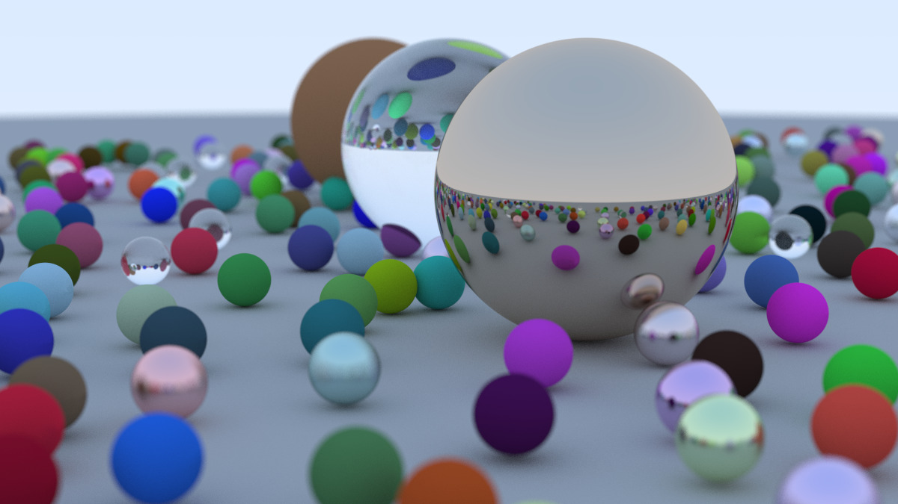

## Raytracer

A multi-threaded ray tracer written in Rust, using Rayon for parallel rendering.

A ray tracer simulates how rays of light travel through a scene, bouncing off objects and materials to produce realistic images with lighting, shadows, and reflections.

Below is an example image rendered by the program:

Note that the render may take a very long time. You may want to reduce the dimensions of the image in `main.rs` -- `IMAGE_WIDTH` and `SAMPLES_PER_PIXEL`.

##  Running the program

`$ cargo build --release`

`$ cargo run > image.ppm`

## Acknowledgement
[Ray Tracing in One Weekend](https://raytracing.github.io/books/RayTracingInOneWeekend.html)